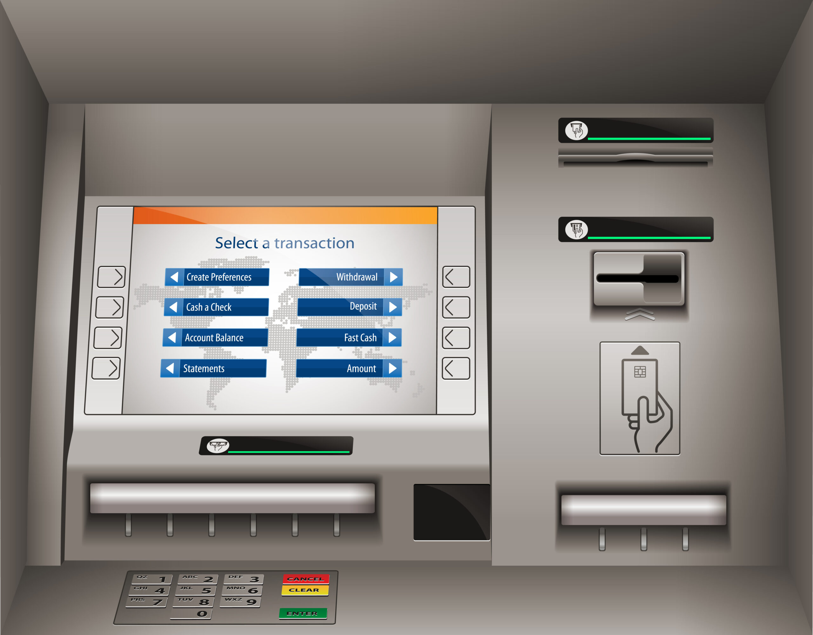

# ATM Machine
This project is aimed at helping people know the benefits of saving, status of your saving and funding to promote and widen business.

## Authors
* [Verinica Daddah Afua](https://github.com/Daddah-Veronica-Afua/ATM_Machine)
* [Precious Togodui](https://github.com/Paatogodui1/ATM_Machine.git)

## Project Overview
This repository contains an interactive command-line project:

 **ATM Machine**:
  A simple ATM simulator that allows users to check
balance, deposit, withdraw, and change their PIN.
This project is aimed at making life simple which is not limited to some but all, believing is not for those who are privileged but we're all blessed.

## Contributors
We welcome and invite contributors to our open project to enhance and expand our codebase.
All contributions are highly valued.
To Contribute:

* ⁠Fork this repository.
* ⁠Make your changes.
* ⁠Submit a pull request.

We do acknowledge and recognize contributors.
We are happy to add you to the  Authors.

Thank you.

##  How to Use This Repository
* Clone the repository to your local machine.
* Navigate to the directory where you cloned it.
* Run the provided Python scripts in your terminal.
* Follow the prompts in each script to interact with the programs.

##  Project Structure:
* control_flow_atm.py: Contains the ATM Machine simulation.

  Objectives:
  * Strengthen control flow through nested conditions.
  * Practice variable manipulation, loops, and functions.
  * Implement enhanced user security and transaction tracking.